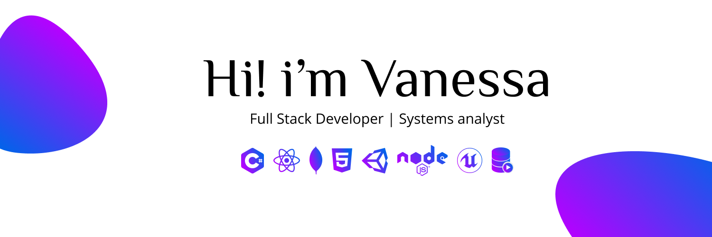

# Welcome to my profile  

  

## About me 
I am a professional in Systems Engineering with experience in the Support area (level 1 and level 2), in database management (SQL Server and Oracle), performing diagnostics and resolution of database integration errors and in the development of reports.

I have knowledge in web application development, desktop with Java, C ++, PHP and Python programming languages, focused on React.JS and .NET frameworks, I have knowledge in video game development in Unity and Unreal engine 4 , in design tools like Illustrator, Photoshop, Blender and Figma.

<ul>
  <li>🔭 I’m currently working on <b> video game 🎮 </b> </li>
 <li>🌱 I’m currently learning <b>Graphql </b>  and <b>Next Js </b></li>
 <li>📚 I want to learn <b>eact Native  </b>  and <b> Flutter  </b> </li>
  <li> 👯 I’m looking to collaborate on <b> OpenSource projects  </b></li>
  <li> 📫 How to reach me <b>vanessa.estefania.correodor@gmail.com </b> </li>
 
</ul>

##  🚀 Languages and Tools:

 
    
    
     
     
     
     
     
     
    
     

  
  

 ## Connect with me:
 

            

  
